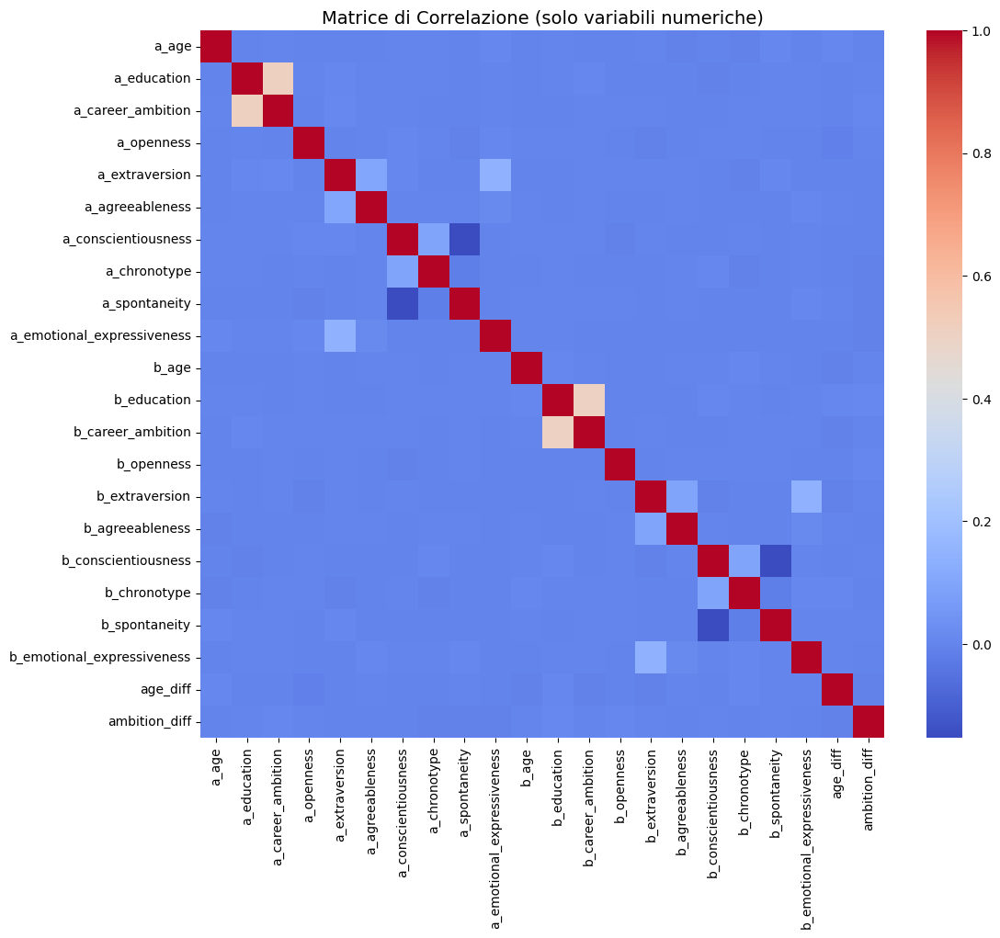
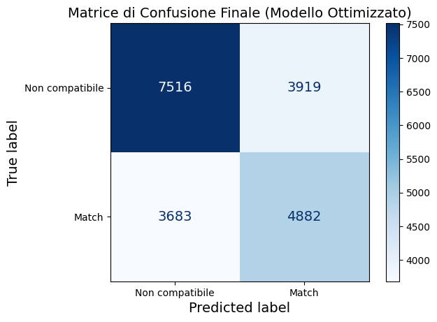
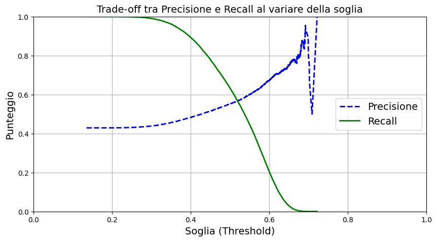
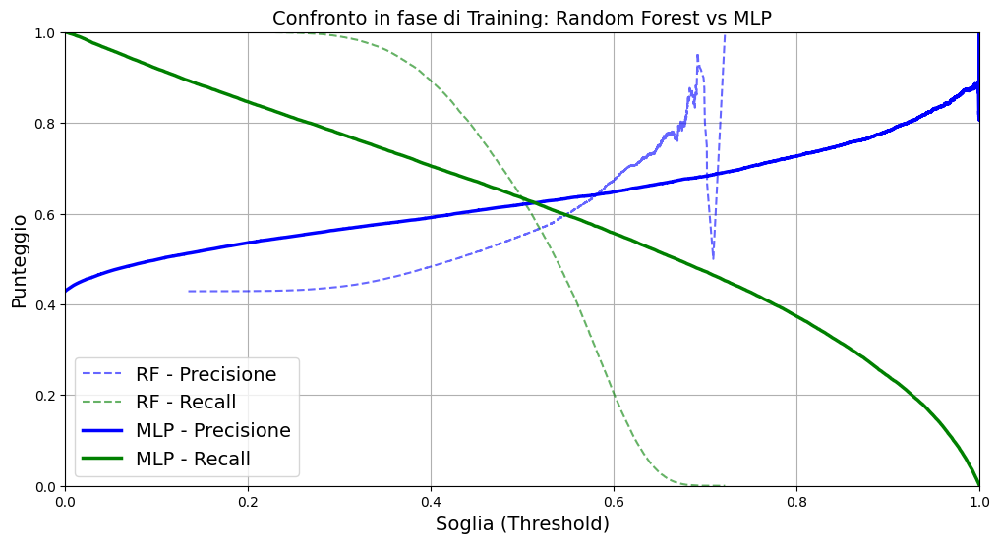
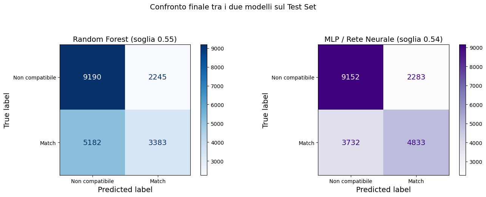

# Cupid's Algorithm 💘 — Previsione della Compatibilità di Coppia con Machine Learning

Progetto di Machine Learning che affronta un problema di **classificazione binaria**:
prevedere se due persone (Persona A e Persona B) sono **compatibili** o meno, a
partire dai loro dati anagrafici e dai loro tratti di personalità.

Il progetto confronta due modelli — **Random Forest** e una **Rete Neurale (MLP)** —
seguendo un flusso di lavoro completo: esplorazione dei dati, preprocessing,
addestramento, ottimizzazione degli iperparametri e valutazione finale su un Test Set
mai visto dal modello.

---

## 📋 Indice

- [Dataset](#-dataset)
- [Struttura del repository](#-struttura-del-repository)
- [Requisiti](#-requisiti)
- [Come eseguire il notebook](#-come-eseguire-il-notebook)
- [Metodologia](#-metodologia)
- [Risultati](#-risultati)
- [Confronto finale tra i modelli](#-confronto-finale-tra-i-modelli)
- [Limiti e possibili miglioramenti](#-limiti-e-possibili-miglioramenti)
- [Autore](#-autore)
- [Licenza](#-licenza)

---

## 📊 Dataset

Il dataset utilizzato è **[Cupid's Algorithm](https://www.kaggle.com/datasets/likithagedipudi/cupids-algorithm)**,
disponibile su Kaggle e scaricato automaticamente tramite `kagglehub`.

Contiene 30 colonne per ogni coppia, tra cui:

- **Dati demografici**: età, livello di istruzione, luogo di residenza, settore
  professionale;
- **Tratti psicologici**: apertura mentale, estroversione, gradevolezza,
  coscienziosità, cronotipo, spontaneità, espressività emotiva, linguaggio dell'amore;
- **Variabili target**: `compatible` (0/1), `compatibility_score`,
  `relationship_longevity_months`.

> Nota: il dataset contiene rumore aggiunto intenzionalmente dall'autore originale,
> per simulare l'imprevedibilità reale delle relazioni umane.

---

## 📁 Struttura del repository

```
├── Cupids_Algorithm_ML_corretto.ipynb   # Notebook completo con codice e spiegazioni
├── README.md                            # Questo file
└── Images/                              # Screenshot dei grafici generati dal notebook
    ├── 01_istogrammi_variabili.png
    ├── 02_matrice_correlazione.png
    ├── 03_matrice_confusione_finale.png
    ├── 04_curva_precision_recall.png
    ├── 05_confronto_rf_vs_mlp_training.png
    └── 06_confronto_finale_rf_vs_mlp.png
```

Per far comparire le immagini in questo README, basta salvare gli screenshot dei
grafici prodotti dal notebook nella cartella `Images/`, usando esattamente questi nomi
(oppure aggiornando i percorsi qui sotto se preferisci nomi diversi).

---

## ⚙️ Requisiti

- Python 3.10+
- Jupyter Notebook o Google Colab
- Le seguenti librerie:

```bash
pip install pandas numpy scikit-learn seaborn matplotlib kagglehub
```

---

## ▶️ Come eseguire il notebook

1. Clona questo repository:
   ```bash
   git clone https://github.com/<tuo-utente>/<tuo-repo>.git
   cd <tuo-repo>
   ```
2. Installa le dipendenze (vedi sopra).
3. Apri il notebook `Cupids_Algorithm_ML_corretto.ipynb` con Jupyter o caricalo su
   Google Colab.
4. Esegui le celle in ordine dall'alto verso il basso: la prima cella scarica
   automaticamente il dataset da Kaggle tramite `kagglehub`.

---

## 🔍 Metodologia

Il notebook è organizzato nei seguenti passaggi:

1. **Importazione dei dati** — download automatico del dataset da Kaggle.
2. **Osservazione del dataset** — prima occhiata alla struttura dei dati.
3. **Training/Test split e Feature Engineering** — separazione dell'80/20% e
   creazione di due nuove variabili (`age_diff`, `ambition_diff`).
4. **Data Exploration** — controllo dei valori mancanti, distribuzioni e matrice di
   correlazione.
5. **Preprocessing** — standardizzazione delle variabili numeriche e codifica delle
   variabili categoriche (One-Hot Encoding).
6. **Addestramento** — modello iniziale Random Forest.
7. **Validazione** — valutazione tramite Cross Validation e F1-Score.
8. **Analisi degli errori** — matrice di confusione, precisione e recall.
9. **Ottimizzazione degli iperparametri** — ricerca con `GridSearchCV`.
10. **Valutazione finale** — test del modello ottimizzato su dati mai visti.
11. **Curve Precision/Recall** — analisi del compromesso tra precisione e recall al
    variare della soglia di decisione.
12. **Confronto con una Rete Neurale (MLP)** — valutazione comparativa finale tra
    Random Forest e MLP sul Test Set.

---

## 📈 Risultati

### Distribuzione delle variabili


Le variabili numeriche (età, tratti di personalità) mostrano distribuzioni
abbastanza uniformi o a campana, senza valori mancanti o anomalie evidenti.

### Matrice di correlazione



Le correlazioni tra le variabili sono generalmente basse, il che esclude
correlazioni spurie e conferma che i dati seguono una logica psicologica
plausibile.

### Matrice di confusione del modello ottimizzato (Random Forest)



Dopo l'ottimizzazione degli iperparametri, il Random Forest raggiunge un
**F1-Score di 0.56** sul Test Set.

### Curva Precision/Recall



Il grafico mostra chiaramente il compromesso tra precisione e recall al variare
della soglia di decisione: aumentando la soglia il modello diventa più preciso ma
individua meno coppie realmente compatibili.

### Confronto Random Forest vs MLP in fase di addestramento



---

## 🏆 Confronto finale tra i modelli

Valutazione sul Test Set (dati mai visti durante l'addestramento):



| Modello | Precisione | Recall | F1-Score |
|---|---|---|---|
| Random Forest (soglia 0.55) | 0.60 | 0.40 | 0.48 |
| **MLP / Rete Neurale (soglia 0.54)** | **0.68** | **0.56** | **0.62** |

La rete neurale (MLP) risulta il modello più efficace, riuscendo a individuare più
coppie realmente compatibili mantenendo comunque una precisione più alta rispetto al
Random Forest.

---

## ⚠️ Limiti e possibili miglioramenti

- L'MLP non è stato ottimizzato con una ricerca sistematica degli iperparametri
  (a differenza del Random Forest, ottimizzato con `GridSearchCV`).
- Le soglie di decisione finali (0.55 e 0.54) sono state scelte osservando i grafici,
  non con una procedura sistematica identica per entrambi i modelli.
- Si potrebbero esplorare altri algoritmi (es. Gradient Boosting) o tecniche di
  bilanciamento delle classi più sofisticate per migliorare ulteriormente il recall
  senza sacrificare la precisione.
- Il dataset contiene rumore aggiunto intenzionalmente, quindi i punteggi ottenuti
  vanno interpretati come un limite intrinseco dei dati più che del modello.

---

## 👤 Autore

Rivera, Lina, Bortoni, Vanina

---

## 📄 Licenza

Questo progetto è distribuito con licenza [MIT](https://opensource.org/licenses/MIT).
Il dataset utilizzato appartiene ai rispettivi autori su Kaggle.

