# Cupid's Algorithm 💘 — Machine Learning sulla Compatibilità di Coppia

Progetto di Machine Learning sul dataset **[Cupid's Algorithm](https://www.kaggle.com/datasets/likithagedipudi/cupids-algorithm)**,
che affronta lo stesso problema da due angolazioni diverse:

- **Classificazione binaria** → prevedere se una coppia è **compatibile** o no
  (`compatible`).
- **Regressione** → prevedere il **punteggio esatto di compatibilità**
  (`compatibility_score`).

In entrambe le parti confrontiamo un modello ad alberi (Random Forest / Decision
Tree) con una **Rete Neurale (MLP)**, e costruiamo variabili di **differenza e
somiglianza** tra i due partner al posto dei loro valori individuali grezzi.

---

## 📋 Indice

- [Dataset](#-dataset)
- [Struttura del repository](#-struttura-del-repository)
- [Requisiti](#-requisiti)
- [Come eseguire i notebook](#-come-eseguire-i-notebook)
- [Parte 1 — Classificazione](#-parte-1--classificazione)
- [Parte 2 — Regressione](#-parte-2--regressione)
- [Conclusioni generali](#-conclusioni-generali)
- [Limiti e possibili miglioramenti](#-limiti-e-possibili-miglioramenti)
- [Licenza](#-licenza)

---

## 📊 Dataset

Il dataset contiene 100.000 coppie, con 30 colonne per ciascuna: dati demografici
(età, istruzione, luogo di residenza, settore professionale) e tratti psicologici
(i Big Five: apertura, coscienziosità, estroversione, gradevolezza; più cronotipo,
spontaneità, espressività emotiva e linguaggio dell'amore) sia per la Persona A sia
per la Persona B, più le variabili target: `compatible`, `compatibility_score`,
`relationship_longevity_months`.

> Il dataset contiene rumore aggiunto intenzionalmente dall'autore originale, per
> simulare l'imprevedibilità reale delle relazioni umane.

Invece di usare i valori grezzi di A e B, in entrambi i notebook costruiamo:
- **Variabili di differenza** (`age_diff`, `openness_diff`, ecc.) per ogni tratto
  numerico;
- **Variabili binarie di somiglianza** (`same_location`, `same_career_field`,
  `same_love_language`) per le variabili categoriche.

Questo perché la compatibilità dipende dalla **relazione** tra i due partner, non
dal valore assoluto di uno solo — e verificando sperimentalmente, questa scelta
migliora le prestazioni dei modelli ed evita un problema di asimmetria (il modello
potrebbe altrimenti trattare diversamente una coppia a seconda di chi viene
etichettato come "A" e chi come "B").

---

## 📁 Struttura del repository

```
├── Progetto_ML_Classificazione.ipynb    # Parte 1: classificazione binaria (compatible)
├── Progetto_ML_Regressione.ipynb        # Parte 2: regressione (compatibility_score)
├── README.md                            # Questo file
└── Images/                              # Screenshot dei grafici generati dai notebook
    ├── classificazione_01_istogrammi.png
    ├── classificazione_02_matrice_correlazione.png
    ├── classificazione_03_matrice_confusione_finale.png
    ├── classificazione_04_curva_precision_recall.png
    ├── classificazione_05_confronto_rf_vs_mlp_training.png
    ├── classificazione_06_confronto_finale_rf_vs_mlp.png
    ├── regressione_01_istogrammi.png
    ├── regressione_02_loss_curve.png
    ├── regressione_03_validation_curve.png
    ├── regressione_04_scatter_mlp.png
    ├── regressione_05_struttura_decision_tree.png
    ├── regressione_06_scatter_decision_tree.png
    └── regressione_07_confronto_finale_metriche.png
```

Per far comparire le immagini in questo README, salva gli screenshot dei grafici
generati dai notebook nella cartella `Images/`, usando esattamente questi nomi
(oppure aggiorna i percorsi qui sotto se preferisci nomi diversi).

---

## ⚙️ Requisiti

- Python 3.10+
- Jupyter Notebook o Google Colab
- Le seguenti librerie:

```bash
pip install pandas numpy scikit-learn seaborn matplotlib scipy kagglehub
```

---

## ▶️ Come eseguire i notebook

1. Clona questo repository:
   ```bash
   git clone https://github.com/<tuo-utente>/<tuo-repo>.git
   cd <tuo-repo>
   ```
2. Installa le dipendenze (vedi sopra).
3. Apri i notebook con Jupyter o caricali su Google Colab.
4. Esegui le celle in ordine dall'alto verso il basso: la prima cella di ciascun
   notebook scarica automaticamente il dataset da Kaggle tramite `kagglehub`.

I due notebook sono indipendenti tra loro (ognuno scarica e prepara i propri dati),
quindi possono essere eseguiti in qualsiasi ordine.

---

## 🔷 Parte 1 — Classificazione

**Obiettivo:** prevedere se una coppia è compatibile (`compatible`, 0/1).

**Modelli confrontati:** Random Forest Classifier (ottimizzato con `GridSearchCV`) e
MLP Classifier (ottimizzato con `GridSearchCV`).

### Distribuzione delle variabili

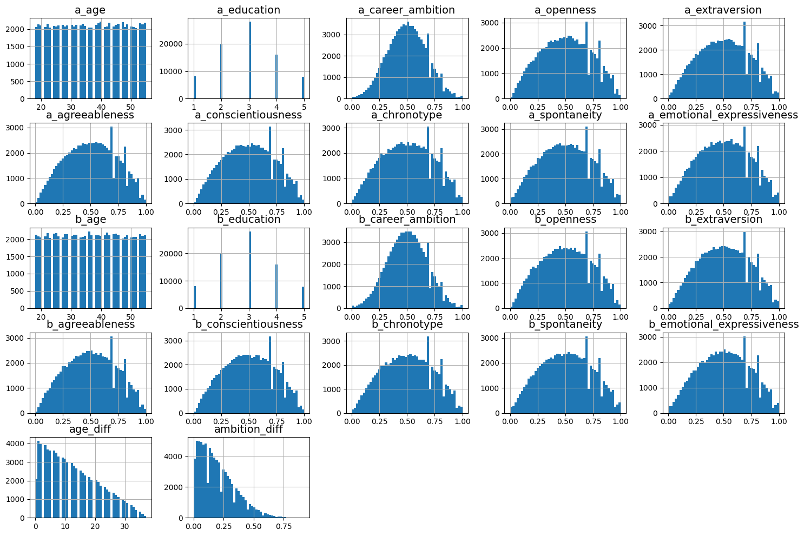

### Matrice di correlazione (variabili di differenza vs target)

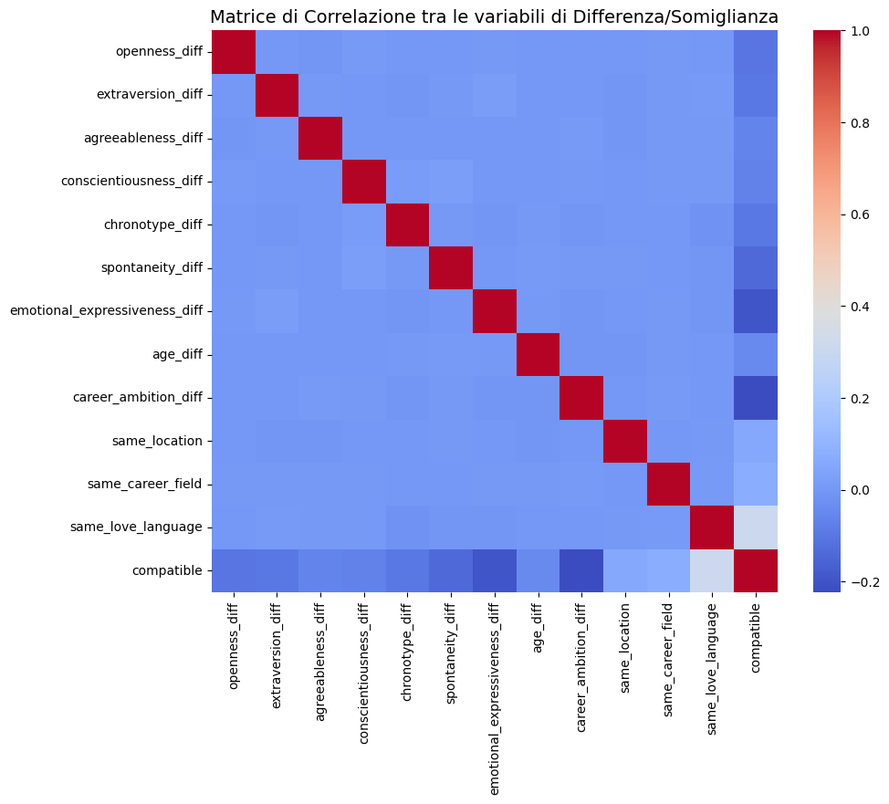

Abbiamo verificato che usare **solo** le variabili di differenza/somiglianza dà
risultati migliori (F1-Score 0.64 in Cross Validation) rispetto a includere anche i
valori grezzi di A e B (F1-Score 0.62).

### Matrice di confusione del Random Forest ottimizzato

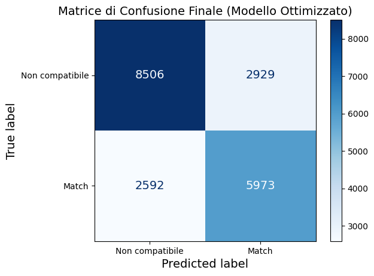

### Curva Precision/Recall

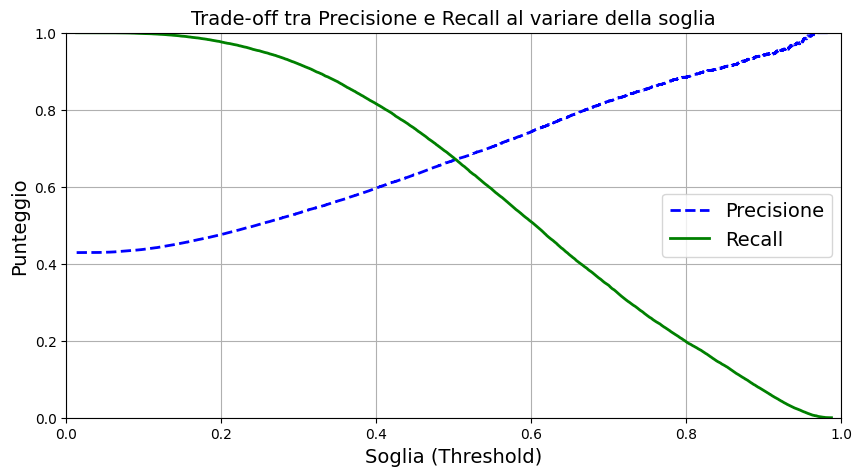

### Confronto Random Forest vs MLP in fase di addestramento

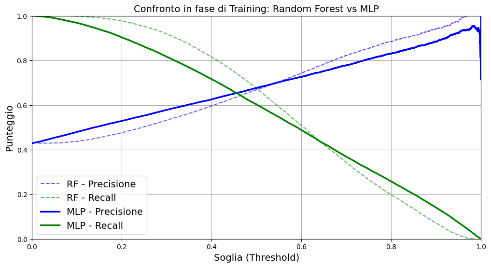

### Risultato finale sul Test Set

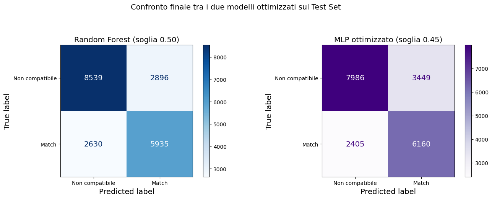

| Modello | Precisione | Recall | F1-Score |
|---|---|---|---|
| **Random Forest (ottimizzato)** | 0.6721 | 0.6929 | **0.6823** |
| MLP (ottimizzato) | 0.6411 | 0.7192 | 0.6779 |

I due modelli, entrambi ottimizzati con `GridSearchCV` e riaddestrati sull'intero
Training Set, ottengono un F1-Score quasi identico, con un lievissimo vantaggio per
il Random Forest.

---

## 🔷 Parte 2 — Regressione

**Obiettivo:** prevedere il punteggio esatto di compatibilità
(`compatibility_score`, un numero da 0 a 100).

**Modelli confrontati:** MLP Regressor e Decision Tree Regressor (ottimizzato con
`GridSearchCV`).

### Distribuzione delle variabili

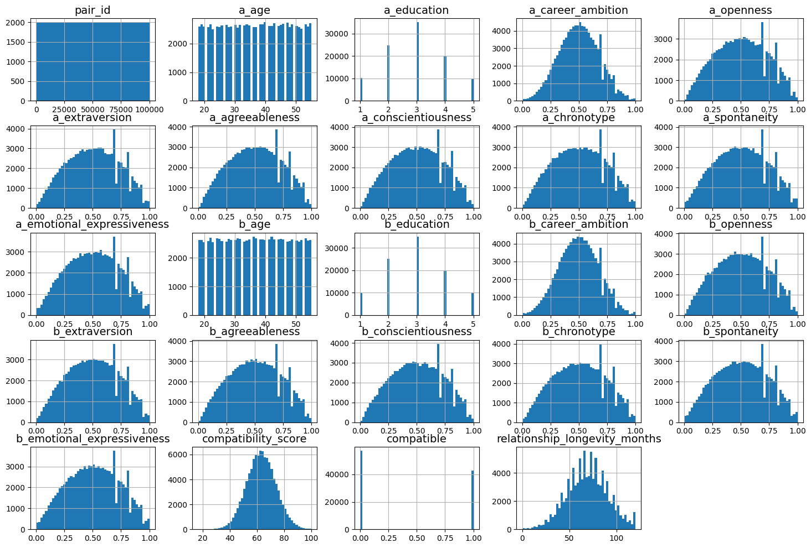

### Addestramento della Rete Neurale (MLP)

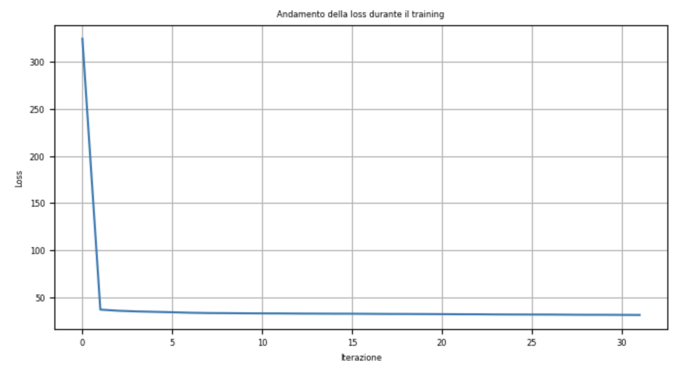

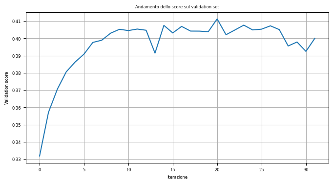

### Previsioni della Rete Neurale sul Test Set

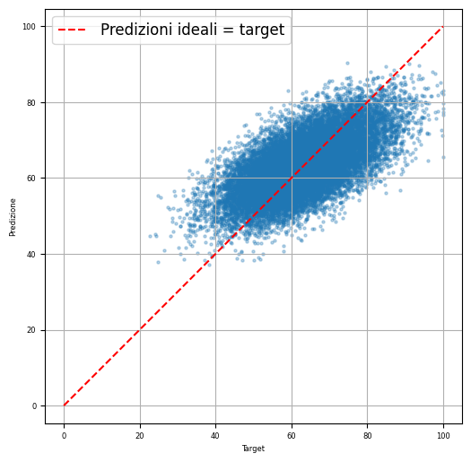

### Struttura del Decision Tree ottimizzato

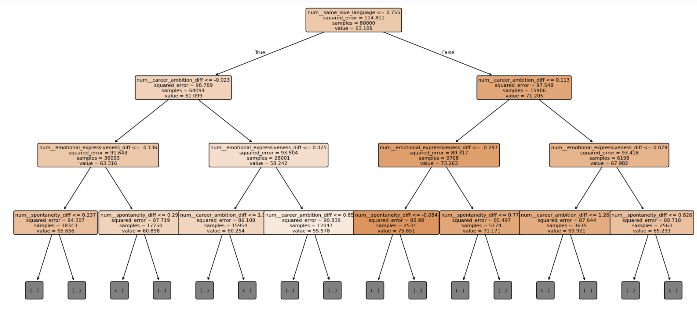

### Previsioni del Decision Tree sul Test Set

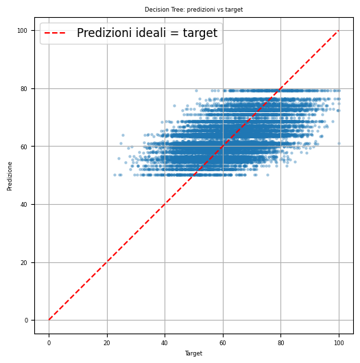

### Confronto finale delle metriche

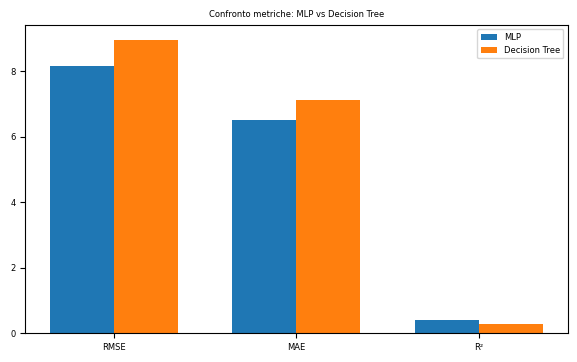

| Metrica | MLP | Decision Tree |
|---|---|---|
| **RMSE** | **8.149** | 8.957 |
| **MAE** | **6.497** | 7.130 |
| **R²** | **0.417** | 0.295 |

L'MLP batte il Decision Tree su tutte e tre le metriche: spiega circa il 42% della
variabilità del punteggio di compatibilità, un risultato modesto ma ragionevole dato
il rumore intenzionale del dataset.

---

## 🏁 Conclusioni generali

Il cambiamento più importante di questo progetto non è stato scegliere tra modelli
ad albero e reti neurali, ma **come rappresentare i dati**: passare dai valori
grezzi di Persona A e Persona B alle loro differenze e somiglianze ha migliorato le
prestazioni in entrambi i problemi (classificazione e regressione), ed evita che il
modello tratti diversamente una coppia a seconda dell'ordine in cui A e B compaiono
nel dataset.

Nella classificazione, Random Forest e MLP — una volta entrambi ottimizzati e
addestrati sull'intero Training Set — ottengono risultati praticamente identici.
Nella regressione, l'MLP si dimostra chiaramente superiore al Decision Tree. In
entrambi i casi, nessun modello raggiunge un punteggio molto alto: un risultato
coerente con il rumore intenzionale aggiunto al dataset per simulare
l'imprevedibilità reale delle relazioni umane.

---

## ⚠️ Limiti e possibili miglioramenti

- Nella regressione non abbiamo ancora verificato se la versione "solo differenze"
  (senza i valori grezzi di A e B) migliora i risultati, come invece confermato
  nella classificazione.
- L'MLP di regressione non è stato ottimizzato con una ricerca sistematica degli
  iperparametri (a differenza del Decision Tree, ottimizzato con `GridSearchCV`).
- Si potrebbero esplorare altri algoritmi (es. Gradient Boosting) o tecniche di
  bilanciamento delle classi più sofisticate per migliorare ulteriormente i
  risultati.

---

## 📄 Licenza

Questo progetto è distribuito con licenza [MIT](https://opensource.org/licenses/MIT).
Il dataset utilizzato appartiene ai rispettivi autori su Kaggle.


